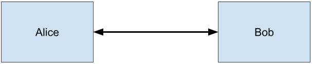
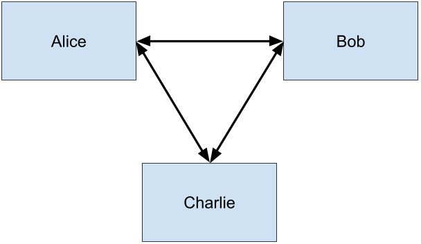
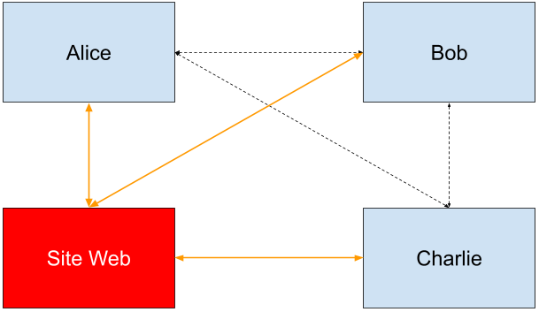

# oedc
Project of a decentralized chat written in JavaScript.

# User Story 1 : Connexion entre deux utilisateurs

Hypothèse : les adresses IP et les ports sont connus par chaque utilisateur.

Scénario :
1. Alice se connecte à Bob
2. Bob accepte la connexion
3. Alice envoie un message à Bob
4. Bob répond au message

Solutions techniques :
- Création d’un fichier ou d’une base de données contenant les identifiants des utilisateurs
- Système de socket d’écoute
- Implémentation de l’interface utilisateur permettant une communication simple

# User Story 2 : Interconnexion de plusieurs utilisateurs

Hypothèse : les adresses IP et les ports de connexion sont connus par chaque utilisateur.

Scénario :
1. Alice crée un salon de discussion
2. Bob et Charlie se connectent au salon
3. Les trois utilisateurs s’envoient des messages
4. Bob est momentanément déconnecté avant la réception d’un message
5. Alice reçoit le message de Charlie avant celui de Bob alors que ce dernier l’a envoyé d’abord

Solutions techniques :
- Amélioration du système de socket d’écoute
- Implémentation des CRDTs
- Gestion et résolution des conflits
- Gestion des déconnexions et des désynchronisations
- Révision de l’interface utilisateur
- Section de création de salon
- Section de connexion à un salon
- Liste des salons disponibles
- Liste des utilisateurs connectés à un salon

# User Story 3 : Implémentation du serveur

Hypothèse : les adresses IP et les ports de connexion ne sont connus d’aucun utilisateur.

Scénario :
1. Alice se connecte au site web et crée un salon
2. Le site web génère un URL et un QR Code pour que d’autres utilisateurs s’y connectent
3. Bob et Charlie se connectent au site web grâce à l'URL et au QR Code
4. Le site web délivre les informations de connexion au salon à Bob et Charlie
5. Tout le monde est connecté et peut envoyer des messages

Solutions techniques :
- Révision de l’interface utilisateur pour incorporer les nouveautés
- Utilisation d’une base de données pour sauvegarder les adresses IP et les ports de connexion
- Mise en place d’un routage dynamique (UPnP) pour que les utilisateurs soient visibles et joignables
- Création d’un chat privé interne au salon

# User Story 4 : Implémentation d'un système de multi-salon

Hypothèse : les adresses IP et les ports de connexion ne sont connus d'aucun utilisateur.

Scénario :
1. Alice crée un salon
2. Bob et Charlie s'y connectent
3. Alice, Bob et Charlie s'envoient des messages
4. Alice crée un autre salon
5. Dylan et Elvis s'y connectent
6. Alice, Dylan et Elvis s'échangent des messages sans que Bob et Charlie ne puissent les voir

Solutions techniques :
- ???

# User Story 5 : Implémentation d'un système d'échange de fichiers

Hypothèse : les adresses IP et les ports de connexion ne sont connus d'aucun utilisateur.

Scénario :
1. Alice crée un salon
2. Bob et Charlie s'y connectent
3. Alice envoie un document PDF à Bob
4. Charlie envoie un audio à Alice et Bob

Solutions techniques :
- ???